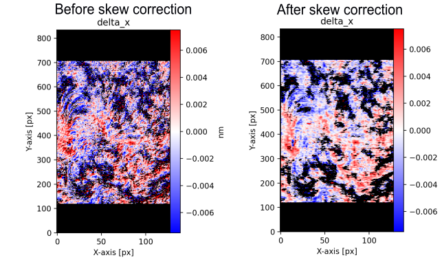

# *SpiceFit*

This code is designed to Fit and perform analysis on the Solar Orbiter/SPICE spectra. The fitting use templates written in .yaml files, that can be edited to your heart content. You can also create new personalized fitting templates. It is also optimised for large raster, working in parallelism.

The code is currently under development. If you encounter problems, or want to add features, please contact the author or raise an issue.

## Installation

You can install SpiceFit in your virtual environment and use it in your own projects. First, you can create a virtual environment by typing the following command in your shell : 

```bash
python -m venv env
source env/bin/activate # write "deactivate" in shell to go out of your virtual environement. 
```
You can install SpiceFit in your virtual environment as followed:
```bash
pip install git+https://github.com/adolliou/SpiceFit
```


## Fitting SPICE spectra 

We here present the most usefull scripts to fit SPICE spectra from a FITS files, and display the results in Figures.
### Creating a template object

The first step is to create the template object you want to use for the fitting. The template object is created using a .yaml file, which describes all the lines and the fitting parameters you want to use for the specific SPICE FITS file window. You can use the templates available by default in core/TemplatesLines folder. 

for instance "c_9_977_96_2c.template.yaml" refer to a fitting template for the C III 977.96 and the Fe XVIII 974.86 lines window with two Gaussian lines ("2c"). Please feel free to create your own fitting templates as yaml files. 

```python

from SpiceFit import FitResults, FittingModel

template_file = "ne_8_770_42_1c.template" 
fittemplate FittingModel(filename=template_file)
```

### Creating a SpiceWindow object

The next step is to create a SpiceWindow object. This object is built with a HDU object from a FITS HUL list. This object is where all the L2 data and header for the spectral window is. 

```python
from SpiceFit import SpiceRasterWindowL2 

url = (
    "https://spice.osups.universite-paris-saclay.fr/spice-data/release-4.0/level2/"
    "2022/03/17/solo_L2_spice-n-ras"
    "_20220317T002536_V03_100663832-017.fits"
)  
hdu_list = fits.open(url)
window = "Ne VIII 770 - Peak"
hdu = hdu_list[window]

spicewindow = SpiceRasterWindowL2(hdu=hdu)

```

### Fitting the SPICE spectra with a FitResults object

You can now fit the SPICE data with a FitResults Object with the SPICE L2 data (spicewindow) and the fitting template (FittingModel). 
``` python
from SpiceFit import FitResults

f = FitResults()
f.fit_spice_window_standard(spicewindow=spicewindow, parallelism=True, cpu_count=16,
                            fit_template=fittemplate, verbose=False)

```

## plotting L3 images (e.g. Radiance)

In the following, we plot the main line radiance. Regular grid set to True means that the image will be reprojected into a regular grid (e.g. in Helioprojective frame), taking into account the rotation. 

```python
fig = plt.figure()
ax=fig.add_subplot()
f.plot_fitted_map(fig=fig, ax=ax, line="main", param="radiance",
                    regular_grid=False, pixels=pixels)
fig.savefig(path_fig2, dpi=50)
```

### Quicklook
The simplest way to plot the fitting results are from the quicklook method. you can show the image as followed
``` python
from SpiceFit import FitResults

f = FitResults()
f.fit_spice_window_standard(spicewindow=spicewindow, parallelism=True, cpu_count=16,
                            fit_template=fittemplate, verbose=False)
f.quicklook(show=False)
```

Alternatively, you can save the image as a PDF file. 
```python
path_fig = "path/to/quicklook.pdf"
fig = f.quicklook(show=False)
fig.savefig(path_fig, dpi=50)
```

### Plotting L3 maps

You can also plot the radiance/Doppler shift or broadening maps of a specific line of the window. Setting regular_grid to True means that the image will be reprojected into a regular grid in the frame described in the SPICE header (Helioprojective frame). Set to false to show the grid in pixels. 


```python
path_fig = "path/to/plot_radiance_map.pdf"

fig = plt.figure()
ax=fig.add_subplot()
f.plot_fitted_map(fig=fig, ax=ax, line="main", param="radiance",
                    regular_grid=False, pixels=pixels)
fig.savefig(path_fig, dpi=50)
```

You can plot the doppler Shift subtracted by its median value over the raster as followed :
```python
fig = plt.figure()
ax = fig.add_subplot()
fitres.plot_fitted_map(fig=fig, ax=ax, line="main", param="delta_x",
                    regular_grid=False, doppler_mediansubtraction=True, )
fig.savefig(os.path.join(resfolder, "doppler.pdf"), dpi=50)
```

## Saving to and loading from a L3 FITS files

This package allows to save a L3 FITS file with the same format as the L3 files from the IDL SPICE data analysis. 

```python
from SpiceFit import FitResults
path_fits = "path/to/SPICE_l3_file.fits"

f = FitResults()
f.fit_spice_window_standard(spicewindow=spicewindow, parallelism=True, cpu_count=16,
                            fit_template=fittemplate, verbose=False)

f.to_fits(path_fits)
```

You can also load a FitsResults object from a L3 FITS file.

```python
from SpiceFit import FitResults
path_fits = "path/to/SPICE_l3_file.fits"

f = FitResults()
f.from_fits(path_fits)
```

## Skew correction
It is possible to perform the fitting procedure with the Skew (and deskew) correction for the SPICE PSF [Skew-correction](https://doi.org/10.48550/arXiv.2508.09121). To do so, please use the following command:


```python
fittemplate  = FittingModel(filename= "c_3_977_96_1c.template")
fitres.fit_spice_window_skew(spicewindow=spicewindow,
                                fit_template = fittemplate,
                                save_folder_skew=datfolder,
                                cpu_count = 8,
                                verbose=4,
                                chi2_limit=100.0, )
```



## UI interface to see the fitting results

This software also includes a UI interface to check the fitting results and the spectra on all points of a raster. To use it, the following commands are available:
```python
from SpiceFit import FitResults, SpiceRaster, FittingModel, SpiceRasterWindowL2
from SpiceFit.ui_interface.SpectralQuicklook import launch_spectral_quicklook

fittemplate = FittingModel(filename="c_3_977_96_1c.template", use_jit=True)

res = FitResults()
res.from_fits(os.path.join(resfolder, "savefile_l3.fits"))
window = launch_spectral_quicklook(res)

```

## License

This package is under MIT License. Please see the LICENSE file for more details.

## Authors 

Antoine Dolliou (dolliou@mps.mpg.de)

## Credits

The design and the operation of the code could not be possible without the following packages, which we acknowledged.  

- [saffron-spice](https://github.com/slimguat/saffron-spice) : Line fitting concepts.
- [eispac](https://github.com/USNavalResearchLaboratory/eispac) : Fitting templates concepts.
- [spice-line-fits](https://github.com/jeplowman/spice-line-fits) :  Skew correction of the SPICE PSF, Doppler detrending.
- [sospice](https://github.com/solo-spice/sospice) : Estimation of the uncertainty on the L2 SPICE data.

## Acknowledgement

If you use this package in your publication, you are welcome to cite it in the acknowledgment as : "This work uses the open-source SpiceFit package, version 0.2.0, available here : https://github.com/adolliou/SpiceFit"

Id you used the Skew correction, please also cite the [Skew-correction](https://doi.org/10.48550/arXiv.2508.09121) paper, or the published peer reviewed paper if it is available.